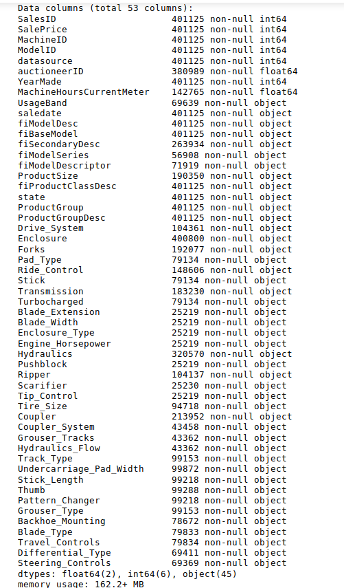
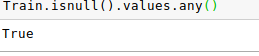
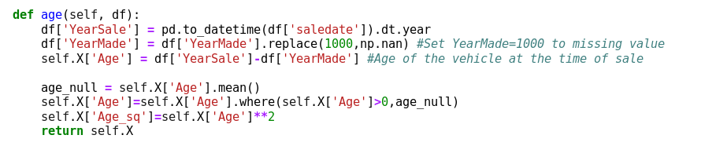
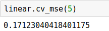
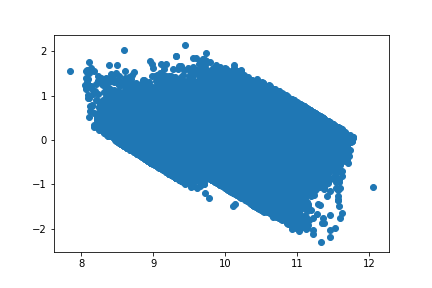
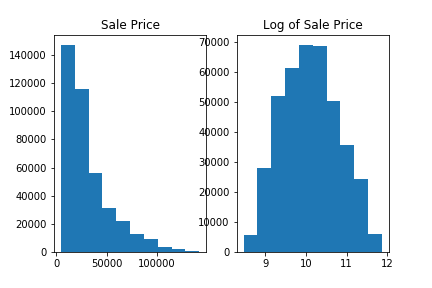
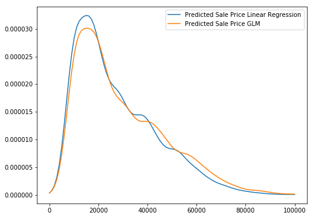

# Price-Prediction-Regression-Analysis

## In this analysis, I will break down our dataset which is used in Kaggle's Blue Book for Bulldozers.

https://www.kaggle.com/c/bluebook-for-bulldozers

We first load the dataset through pandas in order to find out what's inside.

There are 50+ features and as many rows the eye can see!
There also seems to be a number of Nan or zero values from this dataset.

That means that we need to do some data cleaning using pandas.

In our analysis we chose 15 different features from our 50+. I'll show you how we cleaned up one of the columns:

If you owned a vehicle, would data you purchased it matter? Better yet, what if you could find when it was bought and sold. That could give us a good indicator of how sales price could be affected.

If we are going to use it, we need to convert these two columns into a timestamp.

Here we have the values of our Age column. The values for 1000 are very high. A vehicle can't be older than 1000 so we should put these values to mean. That way, we could correctly use our data and not have extreme outliers. We can also clean up the Age values that are negative. How can you buy something before it was ever made?

Time to do a linear regression analysis. This is a simple way of evaluating your mse.

The root mean square error seems to be much higher than we expected. However, let's take a look at the graph in any case.

As you can see, there seems to be a huge amount of heteoscadscity. This means that when as X increases, we tend to have high variance. In order to counteract this problem, we have to take the log of Y so that our values to reduce our variance.

It looks like our log reduced our error a lot. Of course, a simple linear regression isn't enough to fit a model. Eventually we arrived with a generalized linear model to find the lowest mse.

If you have any questions, feel free to contact me on my LinkedIn at:
https://www.linkedin.com/in/justin-ho-0816/
